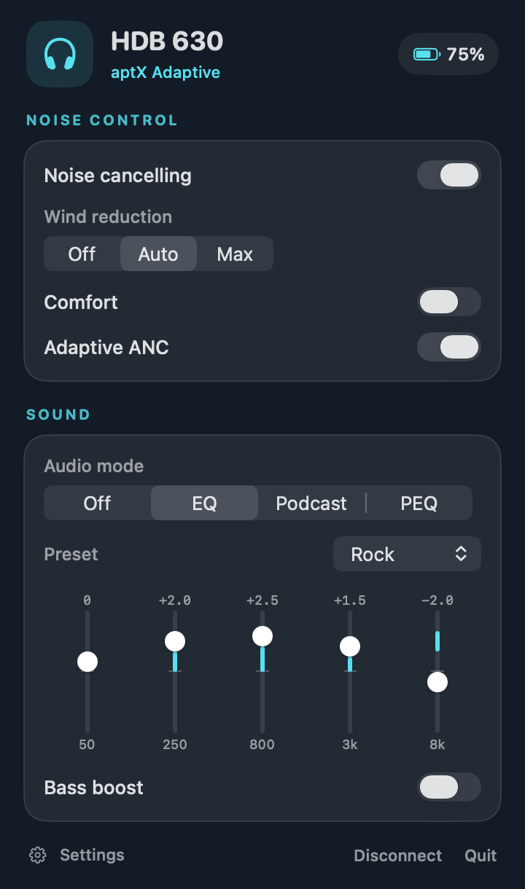
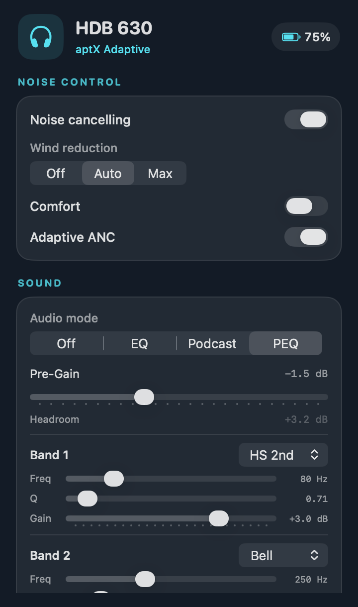
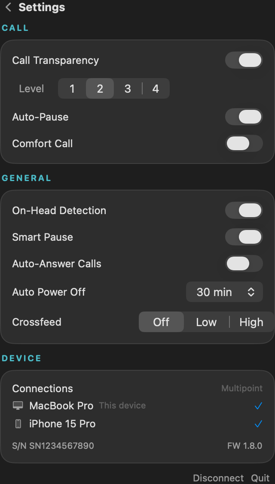

# HDB 630 macOS Controls

Native macOS menu bar app to control Sennheiser HDB 630 headphones and the BTD 700 dongle.

<p>
  
  
  
</p>

## How it works

Communicates with the headphones over Bluetooth Classic RFCOMM using the GAIA v3 protocol (Qualcomm). Despite the Airoha chipset, HDB 630 speaks GAIA v3 -- discovered through reverse engineering the mobile app and Sennheiser's desktop client. BTD 700 settings use its USB HID control interface directly through macOS IOKit; no extra driver or library is needed.

Connection flow:
1. SDP discovery to find the GAIA RFCOMM channel
2. Open RFCOMM channel
3. Register for push notifications (10 Sennheiser features + 1 Qualcomm)
4. Fetch all device state
5. Real-time updates via push notifications + 2-second polling for settings without notification support

## Building

Requires macOS 14+ and Xcode 15+.

```
open HDB630Control.xcodeproj
```

Or with XcodeGen:
```
xcodegen && open HDB630Control.xcodeproj
```

Build and run. The app appears as a headphones icon in the menu bar.

The **Headphones** tab requires pairing the HDB 630 directly to the Mac in System Settings > Bluetooth. This control connection can coexist with BTD 700 audio, but it occupies the headphones' second multipoint slot. The **BTD 700** tab works whenever the dongle is plugged into the Mac, even if the headphones are not paired to the Mac.

If the headphones are already connected to both the dongle and a phone, disconnect the phone before pairing the Mac. Pairing a third active Bluetooth device may displace the dongle and interrupt audio. Once the Mac is connected, the app can open its control channel without taking another slot.

To regenerate screenshots with mock data:
```
xcodebuild -project HDB630Control.xcodeproj -scheme ScreenshotMock -configuration Debug build && \
  $(xcodebuild -project HDB630Control.xcodeproj -scheme ScreenshotMock -configuration Debug -showBuildSettings | grep -m1 BUILT_PRODUCTS_DIR | awk '{print $3}')/screenshot_mock screenshots
```

## Project Structure

```
HDB630Control/
  App/
    AppDelegate.swift          -- Menu bar item, popover, polling
    HDB630ControlApp.swift     -- SwiftUI app entry point
  Bluetooth/
    Models.swift               -- Shared model types (ANCState, EQPreset, etc.)
    GAIAProtocol.swift         -- GAIA v3 packet builder/parser
    BluetoothManager.swift     -- SDP lookup, RFCOMM I/O
    HeadphoneController.swift  -- Device state + all get/set commands
    DongleController.swift     -- BTD 700 USB HID control and status
  UI/
    Components.swift           -- Shared UI components (CardSection)
    StatusBarView.swift        -- Main popover (controls, EQ, PEQ)
    SettingsWindow.swift       -- Settings page (call, general, device info)
    DongleView.swift           -- BTD 700 controls and status

tools/
  MockController.swift         -- Mock stubs for screenshot generation
  main.swift                   -- Headless screenshot renderer
  cli_probe_commands.swift     -- CLI probe script used during RE

docs/                          -- Protocol docs and RE guide
```

## Features

**Noise Control**
- ANC modes: Adaptive, Comfort, Anti-Wind (off/max/auto)
- Global ANC on/off
- Transparency level (0-100)

**Audio**
- Preset EQ (Neutral, Rock, Pop, Dance, Hip-Hop, Classical, Movie, Jazz) with 5-band slider gains and custom detection
- Parametric EQ (5-band PEQ with per-stage frequency, gain, Q, filter type, and pre-gain)
- Bass boost
- Podcast mode
- Crossfeed (off/low/high)
- Codec display (SBC, AAC, aptX, aptX HD, aptX Adaptive, LC3)

**Call**
- Call Transparency / sidetone (off + 4 levels)
- Auto-Pause (pause audio when Call Transparency is active)
- Comfort Call

**Settings**
- On-Head Detection (auto-disables Smart Pause, Auto-Answer, Auto Power Off when off)
- Smart Pause
- Auto-Answer Calls
- Auto Power Off (off/15m/30m/60m)

**Device Info**
- Battery level + charging status
- Firmware version, serial number
- Connected devices (multipoint, view-only)

**BTD 700**
- Live connection state, firmware, active codec, and audio quality
- High Quality / Gaming mode switching
- Reconnect and disconnect controls
- Codec choices when the connected headphones expose more than one option, with rejection errors shown if the dongle declines a request

## Live validation

On an HDB 630 and BTD 700 (firmware 3.11.0), the following controls were changed, read back from the device, and restored: ANC on/off; Anti-Wind Off/Max/Auto; Comfort; Adaptive ANC; transparency; call and general settings; a graphic EQ band; each parametric EQ command type; crossfeed; dongle mode; and dongle disconnect/reconnect. The Anti-Wind values are `0=Off`, `1=Max`, `2=Auto`. Crossfeed uses `0=Low`, `1=High`, `2=Off`.

The app refreshes headset state after discrete writes and reports rejected commands. It also handles multi-stage PEQ notifications. The connected HDB 630 currently reports only aptX Adaptive as a dongle codec option, so codec switching across different headphones remains unverified. Firmware updates and Auracast broadcast configuration still use Sennheiser Dongle Control.

## Known Limitations

- Crossfeed, sidetone, auto-pause, on-head detection, smart pause, auto-answer, comfort call, and auto power off don't fire push notifications -- polled every 2 seconds while popover is open
- BTD 700 USB dongle works for audio but control still goes directly to headphones via separate BT connection
- Multipoint is intentionally view-only, to not cut own connection
- Custom EQ presets created in the mobile app show as "Custom" -- headphones only store raw band gains, preset names live in the phone app's local storage
- The dongle reports only aptX Adaptive as available with the HDB 630 connected on our tested firmware (3.11.0). Other codec requests returned a rejection. The app displays that error instead of claiming the codec changed.
- Firmware updates and Auracast broadcast configuration remain in Sennheiser Dongle Control.

## BTD 700 Dongle & Multipoint

The BTD 700 USB-C dongle appears as a standard USB audio device and a vendor HID control interface. Audio goes: Mac -> USB -> dongle -> Bluetooth -> headphones. This gives you high-quality codecs (aptX Adaptive) that aren't available over regular macOS Bluetooth.

Control (this app) connects directly to the headphones via a **separate** Bluetooth Classic connection. So if you want BTD 700 audio + this app from the same Mac, that's **both multipoint slots taken** -- no room for a third device (e.g. phone):

1. BTD 700 dongle (audio, high-quality codec)
2. Mac Bluetooth (RFCOMM control via this app)

HDB 630 supports up to 2 simultaneous connections and 3 paired devices. Without the dongle, regular Mac Bluetooth handles both audio and control over a single connection, leaving one slot free for another device.

## License

MIT

The headphone controller and UI started from [hatemosphere/hdb630-control-macos](https://github.com/hatemosphere/hdb630-control-macos). BTD 700 HID command identifiers and report layout were informed by [sobalap/btd700ctl](https://github.com/sobalap/btd700ctl).
